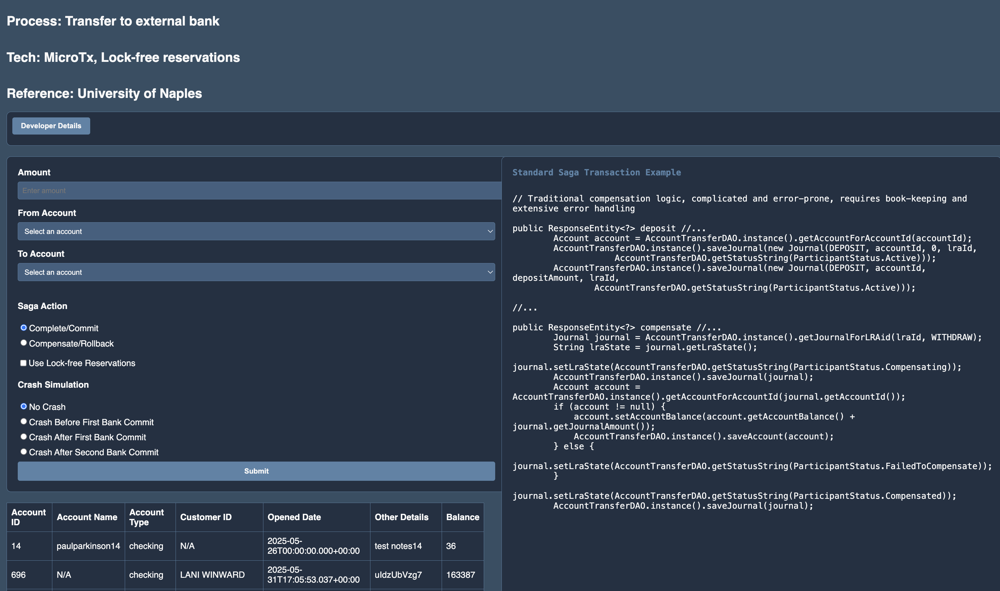

# External bank transfer

## Introduction

### Objectives

- Understand MicroTx, Lock-free reservations, Spring Boot, and Oracle Backend As A Service

### Prerequisites

This lab only requires that you have completed the setup lab.

## Task 1: Follow the Readme

Follow the readme at [this location](https://github.com/paulparkinson/oracle-ai-for-sustainable-dev/tree/main/financial/graph-circular-payments).

You may now **proceed to the next lab.**

## Learn More
* [Developing Event-Driven, Auto-Compensating Saga Transactions For Microservices](https://dzone.com/articles/developing-saga-transactions-for-microservices)
* [Source repos](https://github.com/paulparkinson/saga-examples)
* [Lock-Free Reservation Capability with Oracle Database 23ai](https://blogs.oracle.com/dbstorage/post/new-lockfree-reservation-capability-with-oracle-database-23ai)
* https://docs.oracle.com/en/database/oracle/transaction-manager-for-microservices/24.4/tmmdg/configure-values-yaml-file.html
* [Develop Applications with XA](http://docs.oracle.com/en/database/oracle/transaction-manager-for-microservices/23.4.1/tmmdg/develop-xa-applications.html#GUID-D9681E76-3F37-4AC0-8914-F27B030A93F5)
* [Maintain data consistency across microservices using Oracle MicroTx](https://apexapps.oracle.com/pls/apex/r/dbpm/livelabs/run-workshop?p210_wid=3445)
* [Ensure data consistency in distributed transactions across ORDS applications using MicroTx](https://apexapps.oracle.com/pls/apex/r/dbpm/livelabs/view-workshop?wid=3886)
* [Simplify distributed transactions with Oracle MicroTx to prevent inconsistent data and financial losses](https://apexapps.oracle.com/pls/apex/r/dbpm/livelabs/view-workshop?wid=3725)

## Acknowledgements
* **Authors** - Paul Parkinson, Architect and Developer Advocate
* **Last Updated By/Date** - Paul Parkinson, 2025

