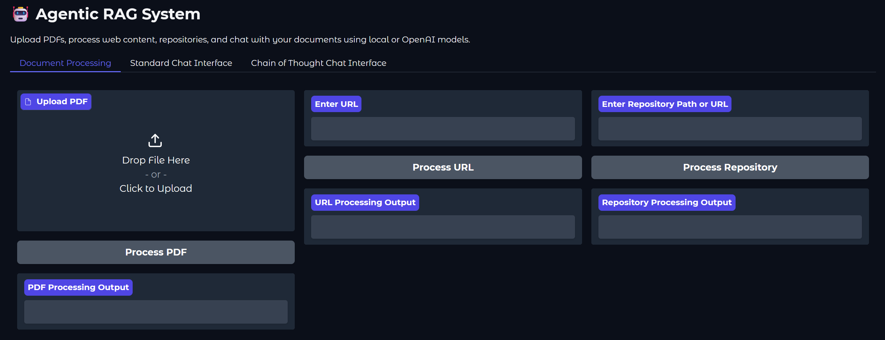
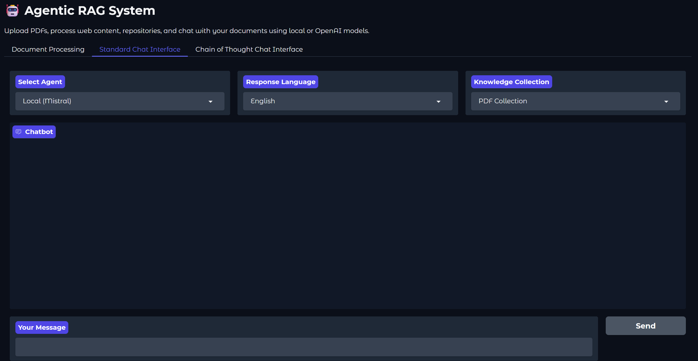
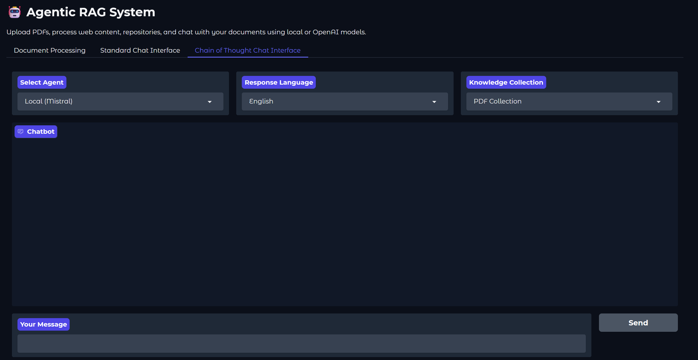
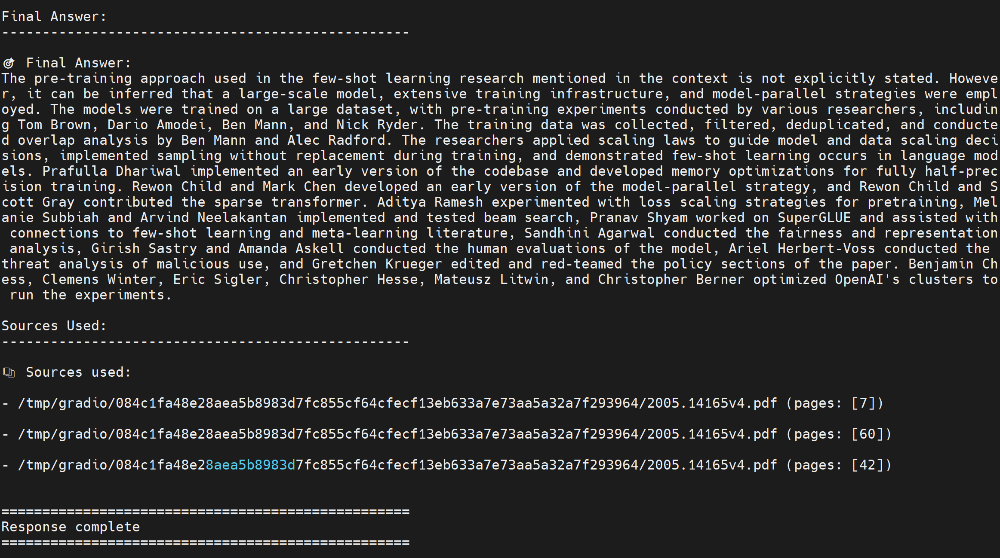

TLDR python main.py python investmentadvisor.py


# Personalized Investment Report Generation (AI Agents, Vector Search, MCP, langgraph)

## Introduction

An intelligent RAG (Retrieval Augmented Generation) system that uses an LLM agent to make decisions about information retrieval and response generation. The system processes PDF documents and can intelligently decide which knowledge base to query based on the user's question.


The system has the following features:

- Intelligent query routing
- PDF processing using Docling for accurate text extraction and chunking
- Persistent vector storage with Oracle Database 23ai (PDF and Websites)
- Smart context retrieval and response generation
- FastAPI-based REST API for document upload and querying
- Support for both OpenAI-based agents or local, transformer-based agents (`Mistral-7B` by default)
- Support for quantized models (4-bit/8-bit) and Ollama models for faster inference
- Optional Chain of Thought (CoT) reasoning for more detailed and structured responses







Here you can find a result of using Chain of Thought (CoT) reasoning:



## 0. Prerequisites and setup

### Prerequisites

- Python 3.8 or higher
- OpenAI API key (optional, for OpenAI-based agent)
- HuggingFace token (optional, for local Mistral model)

### Hardware Requirements

- For the OpenAI Agent: Standard CPU machine
- For the Local Agent: 
  - Minimum 16GB RAM (recommended >24GBs)
  - GPU with 8GB VRAM recommended for better performance
  - Will run on CPU if GPU is not available, but will be significantly slower.
  - For quantized models (4-bit/8-bit): Reduced VRAM requirements (4-6GB) with minimal performance impact
  - For Ollama models: Requires Ollama to be installed and running, with significantly reduced memory requirements

### Setup

1. Clone the repository and install dependencies:

    ```bash
    git clone https://github.com/oracle-devrel/devrel-labs.git
    cd devrel-labs/agentic_rag
    pip install -r requirements.txt
    ```

2. Authenticate with HuggingFace (for Hugging Face models only):
   
   The system uses `Mistral-7B` by default, which requires authentication with HuggingFace:

   a. Create a HuggingFace account [here](https://huggingface.co/join), if you don't have one yet.
   
   b. Accept the Mistral-7B model terms & conditions [here](https://huggingface.co/mistralai/Mistral-7B-Instruct-v0.2)
   
   c. Create an access token [here](https://huggingface.co/settings/tokens)
   
   d. Create a `config.yaml` file (you can copy from `config_example.yaml`), and add your HuggingFace token:
   ```yaml
   HUGGING_FACE_HUB_TOKEN: your_token_here
   ```

3. (Optional) If you want to use the OpenAI-based agent instead of the default local model, create a `.env` file with your OpenAI API key:

   ```bash
   OPENAI_API_KEY=your-api-key-here
   ```

   If no API key is provided, the system will automatically download and use `Mistral-7B-Instruct-v0.2` for text generation when using the local model. No additional configuration is needed.
   
4. For quantized models, ensure bitsandbytes is installed:

    ```bash
    pip install bitsandbytes>=0.41.0
    ```

5. For Ollama models, install Ollama:

    a. Download and install Ollama from [ollama.com/download](https://ollama.com/download) for Windows, or run the following command in Linux:

      ```bash
      curl -fsSL https://ollama.com/install.sh | sh
      ```
    
    b. Start the Ollama service
    
    c. Pull the models you want to use beforehand:
    
    ```bash
    ollama pull llama3
    ollama pull phi3
    ollama pull qwen2
    ```

## 1. Getting Started

You can launch this solution in three ways:

### 1. Using the Complete REST API

Start the API server:

```bash
python main.py
```

The API will be available at `http://localhost:8000`. You can then use the API endpoints as described in the API Endpoints section below.

### 2. Using the Gradio Interface (Recommended)

The system provides a user-friendly web interface using Gradio, which allows you to:
- Select and pull `ollama` models directly from the interface
- Upload and process PDF documents
- Process web content from URLs
- Chat with your documents using either local or OpenAI models
- Toggle Chain of Thought reasoning

To launch the interface:

```bash
python gradio_app.py
```

This will start the Gradio server and automatically open the interface in your default browser at `http://localhost:7860`. The interface has two main tabs:

1. **Model Management**:
   - Download models in advance to prepare them for use
   - View model information including size and VRAM requirements
   - Check download status and error messages

2. **Document Processing**:
   - Upload PDFs using the file uploader
   - Process web content by entering URLs
   - View processing status and results

3. **Chat Interface**:
   - Select between different model options:
     - Local (Mistral) - Default Mistral-7B model (recommended)
     - Local (Mistral) with 4-bit or 8-bit quantization for faster inference
     - Ollama models (llama3, phi-3, qwen2) as alternative options
     - OpenAI (if API key is configured)
   - Toggle Chain of Thought reasoning for more detailed responses
   - Chat with your documents using natural language
   - Clear chat history as needed

Note: The interface will automatically detect available models based on your configuration:
- Local Mistral model requires HuggingFace token in `config.yaml` (default option)
- Ollama models require Ollama to be installed and running (alternative options)
- OpenAI model requires API key in `.env` file

### 3. Using Individual Python Components via Command Line

#### Process PDFs

To process a PDF file and save the chunks to a JSON file, run:

```bash
# Process a single PDF
python pdf_processor.py --input path/to/document.pdf --output chunks.json

# Process multiple PDFs in a directory
python pdf_processor.py --input path/to/pdf/directory --output chunks.json

# Process a single PDF from a URL 
python pdf_processor.py --input https://example.com/document.pdf --output chunks.json
# sample pdf: https://arxiv.org/pdf/2203.06605
```

#### Process Websites with Trafilatura

Process a single website and save the content to a JSON file:

```bash
python web_processor.py --input https://example.com --output docs/web_content.json
```

Or, process multiple URLs from a file and save them into a single JSON file:

```bash
python web_processor.py --input urls.txt --output docs/web_content.json
```

#### Manage Vector Store

To add documents to the vector store and query them, run:

```bash
# Add documents from a chunks file, by default to the pdf_collection
python store.py --add chunks.json
# for websites, use the --add-web flag
python store.py --add-web docs/web_content.json

# Query the vector store directly, both pdf and web collections
# llm will make the best decision on which collection to query based upon your input
python store.py --query "your search query"
python local_rag_agent.py --query "your search query"
```

#### Test Oracle DB Vector Store

The system includes a test script to verify Oracle DB connectivity and examine the contents of your collections. This is useful for:
- Checking if Oracle DB is properly configured
- Viewing statistics about your collections
- Inspecting the content stored in each collection
- Testing basic vector search functionality

To run the test:

```bash
# Basic test - checks connection and runs a test query
python test_oradb.py

# Show only collection statistics without inserting test data
python test_oradb.py --stats-only

# Specify a custom query for testing
python test_oradb.py --query "artificial intelligence"
```

The script will:
1. Verify Oracle DB credentials in your `config.yaml` file
2. Test connection to the Oracle DB
3. Display the total number of chunks in each collection (PDF, Web, Repository, General Knowledge)
4. Show content and metadata from the most recently inserted chunk in each collection
5. Unless running with `--stats-only`, insert test data and run a sample vector search

Requirements:
- Oracle DB credentials properly configured in `config.yaml`:
  ```yaml
  ORACLE_DB_USERNAME: ADMIN
  ORACLE_DB_PASSWORD: your_password_here
  ORACLE_DB_DSN: your_connection_string_here
  ```
- The `oracledb` Python package installed

#### Use RAG Agent

To query documents using either OpenAI or a local model, run:

```bash
# Using OpenAI (requires API key in .env)
python rag_agent.py --query "Can you explain the DaGAN Approach proposed in the Depth-Aware Generative Adversarial Network for Talking Head Video Generation article?"

# Using local Mistral model
python local_rag_agent.py --query "Can you explain the DaGAN Approach proposed in the Depth-Aware Generative Adversarial Network for Talking Head Video Generation article?"
```

### 4. Complete Pipeline Example

First, we process a document and query it using the local model. Then, we add the document to the vector store and query from the knowledge base to get the RAG system in action.

```bash
# 1. Process the PDF
python pdf_processor.py --input example.pdf --output chunks.json

#python pdf_processor.py --input https://arxiv.org/pdf/2203.06605 --output chunks.json

# 2. Add to vector store
python store.py --add chunks.json

# 3. Query using local model
python local_rag_agent.py --query "Can you explain the DaGAN Approach proposed in the Depth-Aware Generative Adversarial Network for Talking Head Video Generation article?"

# Or using OpenAI (requires API key):
python rag_agent.py --query "Can you explain the DaGAN Approach proposed in the Depth-Aware Generative Adversarial Network for Talking Head Video Generation article?"
```

## 2. Chain of Thought (CoT) Support

The system implements an advanced multi-agent Chain of Thought system, allowing complex queries to be broken down and processed through multiple specialized agents. This feature enhances the reasoning capabilities of both local and cloud-based models.

### Multi-Agent System

The CoT system consists of four specialized agents:

1. **Planner Agent**: Breaks down complex queries into clear, manageable steps
2. **Research Agent**: Gathers and analyzes relevant information from knowledge bases
3. **Reasoning Agent**: Applies logical analysis to information and draws conclusions
4. **Synthesis Agent**: Combines multiple pieces of information into a coherent response

### Using CoT

You can activate the multi-agent CoT system in several ways:

1. **Command Line**:
```bash
# Using local Mistral model (default)
python local_rag_agent.py --query "your query" --use-cot

# Using OpenAI model
python rag_agent.py --query "your query" --use-cot
```

2. **Testing the System**:
```bash
# Test with local model (default)
python tests/test_new_cot.py

# Test with OpenAI model
python tests/test_new_cot.py --model openai
```

3. **API Endpoint**:
```http
POST /query
Content-Type: application/json

{
    "query": "your query",
    "use_cot": true
}
```

### Example Output

When CoT is enabled, the system will show:
- The initial plan for answering the query
- Research findings for each step
- Reasoning process and conclusions
- Final synthesized answer
- Sources used from the knowledge base

Example:
```
Step 1: Planning
- Break down the technical components
- Identify key features
- Analyze implementation details

Step 2: Research
[Research findings for each step...]

Step 3: Reasoning
[Logical analysis and conclusions...]

Final Answer:
[Comprehensive response synthesized from all steps...]

Sources used:
- document.pdf (pages: 1, 2, 3)
- implementation.py
```

### Benefits

The multi-agent CoT approach offers several advantages:
- More structured and thorough analysis of complex queries
- Better integration with knowledge bases
- Transparent reasoning process
- Improved answer quality through specialized agents
- Works with both local and cloud-based models

## Annex: API Endpoints

### Upload PDF

```http
POST /upload/pdf
Content-Type: multipart/form-data

file: <pdf-file>
```

This endpoint uploads and processes a PDF file, storing its contents in the vector database.

### Query

```http
POST /query
Content-Type: application/json

{
    "query": "your question here"
}
```

This endpoint processes a query through the agentic RAG pipeline and returns a response with context.

## Annex: Architecture


The system consists of several key components:

1. **PDF Processor**: we use `docling` to extract and chunk text from PDF documents
2. **Web Processor**: we use `trafilatura` to extract and chunk text from websites
3. **GitHub Repository Processor**: we use `gitingest` to extract and chunk text from repositories
4. **Vector Store**: Manages document embeddings and similarity search using `Oracle Database 23ai` (default) or `ChromaDB` (fallback)
5. **RAG Agent**: Makes intelligent decisions about query routing and response generation
   - OpenAI Agent: Uses `gpt-4-turbo-preview` for high-quality responses, but requires an OpenAI API key
   - Local Agent: Uses `Mistral-7B` as an open-source alternative
6. **FastAPI Server**: Provides REST API endpoints for document upload and querying
7. **Gradio Interface**: Provides a user-friendly web interface for interacting with the RAG system

The RAG Agent flow is the following:

1. Analyzes query type
2. Try to find relevant PDF context, regardless of query type
3. If PDF context is found, use it to generate a response.
4. If no PDF context is found OR if it's a general knowledge query, use the pre-trained LLM directly
5. Fall back to a "no information" response only in edge cases.

## Annex: Command Line Usage

You can run the system from the command line using:

```bash
python local_rag_agent.py --query "Your question here" [options]
```

### Command Line Arguments

| Argument | Description | Default |
| --- | --- | --- |
| `--query` | The query to process | *Required* |
| `--embeddings` | Select embeddings backend (`oracle` or `chromadb`) | `oracle` |
| `--model` | Model to use for inference | `mistralai/Mistral-7B-Instruct-v0.2` |
| `--collection` | Collection to query (PDF, Repository, Web, General) | Auto-determined |
| `--use-cot` | Enable Chain of Thought reasoning | `False` |
| `--store-path` | Path to ChromaDB store (if using ChromaDB) | `embeddings` |
| `--skip-analysis` | Skip query analysis step | `False` |
| `--verbose` | Show full content of sources | `False` |
| `--quiet` | Disable verbose logging | `False` |

### Examples

Query using Oracle DB (default):
```bash
python local_rag_agent.py --query "How does vector search work?"
```

Force using ChromaDB:
```bash
python local_rag_agent.py --query "How does vector search work?" --embeddings chromadb
```

Query with Chain of Thought reasoning:
```bash
python local_rag_agent.py --query "Explain the difference between RAG and fine-tuning" --use-cot
```

Query a specific collection:
```bash
python local_rag_agent.py --query "How to implement a queue?" --collection "Repository Collection"
```

## Contributing

This project is open source. Please submit your contributions by forking this repository and submitting a pull request! Oracle appreciates any contributions that are made by the open source community.

## License

Copyright (c) 2024 Oracle and/or its affiliates.

Licensed under the Universal Permissive License (UPL), Version 1.0.

See [LICENSE](../LICENSE) for more details.

ORACLE AND ITS AFFILIATES DO NOT PROVIDE ANY WARRANTY WHATSOEVER, EXPRESS OR IMPLIED, FOR ANY SOFTWARE, MATERIAL OR CONTENT OF ANY KIND CONTAINED OR PRODUCED WITHIN THIS REPOSITORY, AND IN PARTICULAR SPECIFICALLY DISCLAIM ANY AND ALL IMPLIED WARRANTIES OF TITLE, NON-INFRINGEMENT, MERCHANTABILITY, AND FITNESS FOR A PARTICULAR PURPOSE. FURTHERMORE, ORACLE AND ITS AFFILIATES DO NOT REPRESENT THAT ANY CUSTOMARY SECURITY REVIEW HAS BEEN PERFORMED WITH RESPECT TO ANY SOFTWARE, MATERIAL OR CONTENT CONTAINED OR PRODUCED WITHIN THIS REPOSITORY. IN ADDITION, AND WITHOUT LIMITING THE FOREGOING, THIRD PARTIES MAY HAVE POSTED SOFTWARE, MATERIAL OR CONTENT TO THIS REPOSITORY WITHOUT ANY REVIEW. USE AT YOUR OWN RISK.